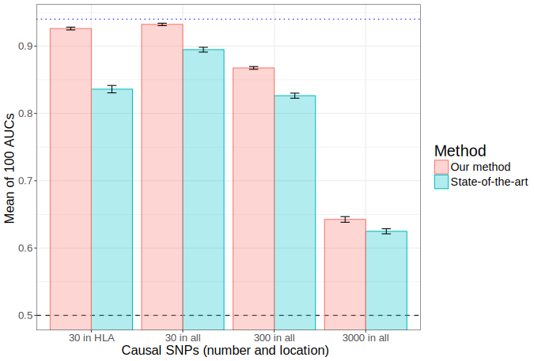

```{r setup, include=FALSE}
options(htmltools.dir.version = FALSE)
knitr::opts_chunk$set(echo = FALSE, message = FALSE, comment = "",
                      fig.align = "center", dev = "svg")
```

## Personalized genetic medicine:

```{r, out.width="75%"}
knitr::include_graphics("https://www.frontiersin.org/files/Articles/137943/fmicb-06-00411-HTML/image_m/fmicb-06-00411-g001.jpg")
```

.footnote[
Source: Oliveira-Coelho, Ana, et al. "Paving the way for predictive diagnostics and personalized treatment of invasive aspergillosis." Frontiers in microbiology 6 (2015).
]

---

## Data

0, 1 or 2 mutations per individual and per locus (position on the genome):

```{r}
library(bigsnpr)
bigsnp <- snp_attachExtdata()
G <- bigsnp$genotypes
G[1:12, 1:11]
```

</br>

Size of current datasets (UK Biobank): 500,000 individuals and (at least) 800,000 loci.

---

## Goal

$$\boxed{\Large{\text{Disease} \sim \text{DNA mutations}} + \cdots}$$

</br>

## Methods

- statistical learning methods

- clever implementations for handling large datasets

- two R packages (Privé et al., 2017)

---

## Assessing predictive performance

AUC (Area Under the ROC Curve) is often used.

```{r, out.width="45%", fig.cap="Example of ROC curve."}
knitr::include_graphics("https://i.stack.imgur.com/5x3Xj.png")
```

</br>

$$\text{AUC} = P(S_\text{case} > S_\text{control})$$

---

## Results (simulating different disease architectures)

```{r}

```

---

class: center, middle, inverse

# Thanks!

<br>

Twitter and GitHub: [@privefl](https://twitter.com/privefl)

.footnote[Slides created via the R package [**xaringan**](https://github.com/yihui/xaringan).]
