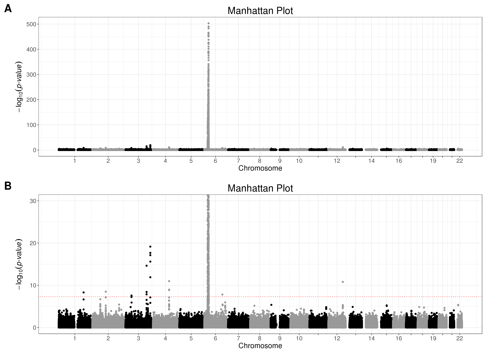
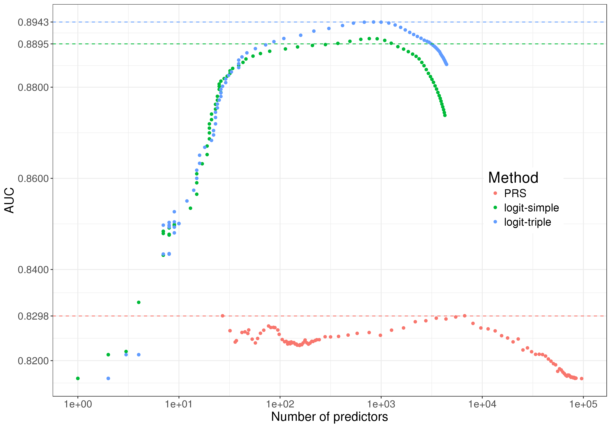
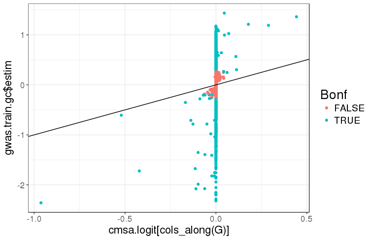
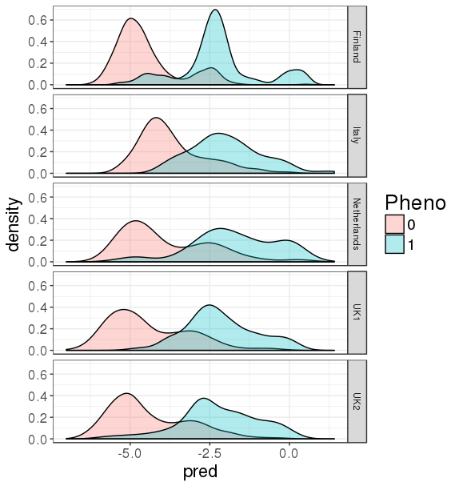
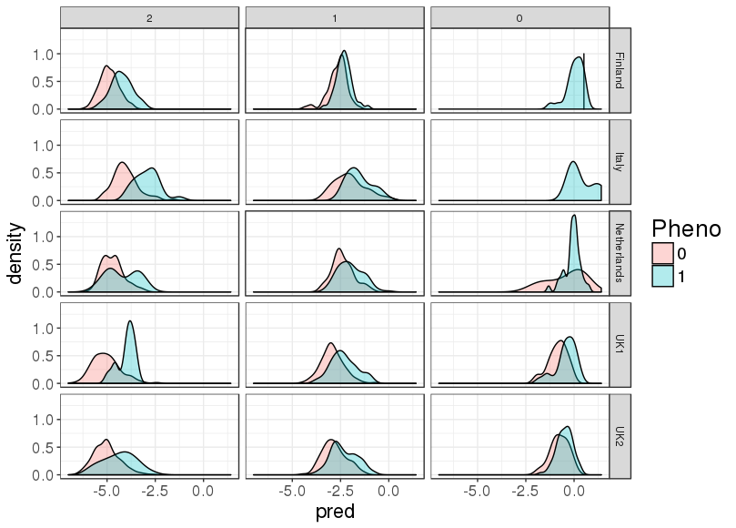
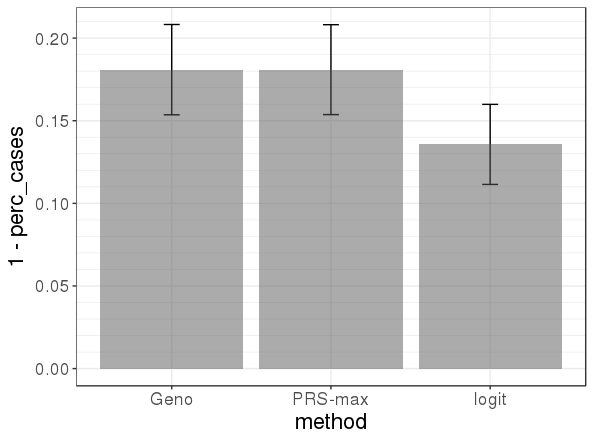
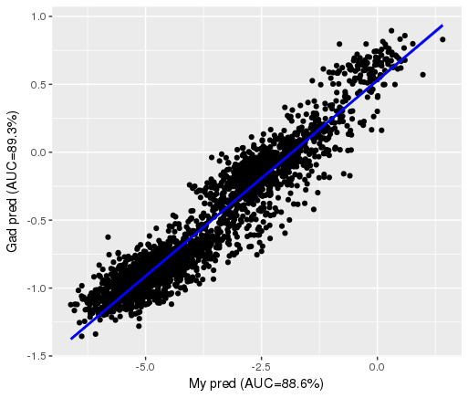

```{r setup, include=FALSE}
knitr::opts_chunk$set(fig.align = "center", out.width = "70%", fig.asp = 0.7,
                      dev = "svg")
options(width = 110)
```

## Useful functions

```{r, message=FALSE}
library(tidyverse)
```

```{r}
myggplot <- function(..., coeff = 1) {
  bigstatsr:::MY_THEME(ggplot(...), coeff = coeff)
} 
```

```{r}
plot_results <- function(results, y, ylab = y) {
  
  dist <- "Distribution\nof effects"
  
  myggplot(results) +
    geom_boxplot(aes_string("method", y, color = "par.dist", 
                            fill = "par.dist"), alpha = 0.3) + 
    theme(axis.text.x = element_text(angle = 45, hjust = 1)) +
    facet_grid(par.model ~ par.causal) +
    theme(strip.text.x = element_text(size = rel(2)),
          strip.text.y = element_text(size = rel(2))) +
    labs(x = "Method", y = ylab, fill = dist, color = dist)
}
```

```{r}
boot <- function(x, n = 1e5, f = mean) {
  sd(replicate(n, f(sample(x, replace = TRUE))))
}
```


## Results with T-Trees

```{r}
top10 <- 1:110
top20 <- 1:220

# Put all results in a single tibble
results1 <- list.files("results1", full.names = TRUE) %>%
  map_dfr(~readRDS(.x)) %>%
  as_tibble() %>%
  mutate(
    par.causal = factor(map_chr(par.causal, ~paste(.x[1], .x[2], sep = " in ")),
                        levels = c("30 in HLA", paste(3 * 10^(1:3), "in all"))),
    AUC = map_dbl(eval, ~bigstatsr::AUC(.x[, 1], .x[, 2])),
    percCases10 = map_dbl(eval, ~mean(.x[order(.x[, 1], decreasing = TRUE)[top10], 2])),
    percCases20 = map_dbl(eval, ~mean(.x[order(.x[, 1], decreasing = TRUE)[top20], 2]))
  )
```

```{r}
results1 %>%
  group_by_at(c(vars(starts_with("par")), "method")) %>%
  summarise_at(c("timing", "nb.preds", "AUC", "percCases10", "percCases20"), mean) %>%
  print(n = Inf)
```

```{r, fig.width=16, out.width="95%", dev="svg", fig.cap="Results of T-Trees vs penalized logistic regression. **A.** Timing (in seconds). **B.** Number of predictors of the model. **C.** AUC. **D.** Percentage of cases in the 10% largest scores."}
ttrees_vs_logit <- filter(results1, method %in% c("T-Trees", "logit-simple"))

p_list <- list(
  plot_results(ttrees_vs_logit, "timing", "Timing (in seconds)") +
    scale_y_continuous(breaks = 0:10 * 2000, minor_breaks = NULL),
  plot_results(ttrees_vs_logit, "nb.preds", "Number of predictors (log-scale)") +
    scale_y_log10(breaks = c(10^(0:7), 3 * 10^(0:7)), minor_breaks = NULL,
                  labels = scales::comma_format()),
  plot_results(ttrees_vs_logit, "AUC") +
    scale_y_continuous(breaks = 0:10 / 10, minor_breaks = c(0:9 + 0.5) / 10),
  plot_results(ttrees_vs_logit, "percCases10", "Percentage of cases in top 10%") +
    scale_y_continuous(breaks = 0:10 / 10, minor_breaks = c(0:9 + 0.5) / 10)
)

lapply(p_list, function(p) p + theme(legend.position = "none")) %>%
  cowplot::plot_grid(plotlist = ., ncol = 2, align = "hv", scale = 0.9,
                     labels = LETTERS[1:4], label_size = 25) %>%
  cowplot::plot_grid(cowplot::get_legend(p_list[[1]]),
                     rel_widths = c(1, 0.15))
```

```{r}
ggsave("figures/ttrees.pdf", scale = 1/90, width = 1580, height = 1070)
```


## Results without T-Trees

### Correlation between predictive performance measures

```{r}
top10 <- 1:110
top20 <- 1:220

# Put all results in a single tibble
results2 <- list.files("results2", full.names = TRUE) %>%
  map_dfr(~readRDS(.x)) %>%
  as_tibble() %>%
  mutate(
    par.causal = factor(map_chr(par.causal, ~paste(.x[1], .x[2], sep = " in ")),
                        levels = c("30 in HLA", paste(3 * 10^(1:3), "in all"))),
    AUC = map_dbl(eval, ~bigstatsr::AUC(.x[, 1], .x[, 2])),
    percCases10 = map_dbl(eval, ~mean(.x[order(.x[, 1], decreasing = TRUE)[top10], 2])),
    percCases20 = map_dbl(eval, ~mean(.x[order(.x[, 1], decreasing = TRUE)[top20], 2]))
  )
```

```{r, fig.width=14, out.width="90%", dev="svg", fig.cap="Percentage of cases in the 2 highest deciles of PRSs as a function of AUC."}
H2 <- 0.8
cowplot::plot_grid(
  results2 %>%
    filter(par.h2 == H2) %>%
    myggplot(aes(AUC, percCases10, color = par.dist)) +
    geom_point() +
    geom_smooth(method = "lm") +
    theme(legend.position = c(0.8, 0.2)) +
    labs(y = "Percentage of cases in top 10%", 
         color = "Distribution\nof effects"),
  results2 %>%
    filter(par.h2 == H2) %>%
    myggplot(aes(AUC, percCases20, color = par.dist)) +
    geom_point() +
    geom_smooth(method = "lm") +
    theme(legend.position = c(0.8, 0.2)) +
    labs(y = "Percentage of cases in top 20%", 
         color = "Distribution\nof effects"),
  results2 %>%
    filter(par.h2 == H2) %>%
    myggplot(aes(AUC, percCases10, color = par.model)) +
    geom_point() +
    geom_smooth(method = "lm") +
    theme(legend.position = c(0.8, 0.2)) +
    scale_colour_brewer(palette = "Set1") +
    labs(y = "Percentage of cases in top 10%", 
         color = "Model"),
  results2 %>%
    filter(par.h2 == H2) %>%
    myggplot(aes(AUC, percCases20, color = par.model)) +
    geom_point() +
    geom_smooth(method = "lm") +
    theme(legend.position = c(0.8, 0.2)) +
    scale_colour_brewer(palette = "Set1") +
    labs(y = "Percentage of cases in top 20%", 
         color = "Model"),
  labels = LETTERS[1:4], align = "hv", label_size = 25, scale = 0.95
)
```

```{r}
ggsave("figures/AUC-corr.pdf", scale = 1/90, width = 1300, height = 950)
```

### Results of AUC

```{r, fig.cap="All AUC results for h2=0.8 and all chromosomes"}
results2 %>%
  filter(par.h2 == 0.8) %>%
  plot_results("AUC") +
  geom_hline(yintercept = 0.94, color = "blue", linetype = 3) +
  scale_y_continuous(breaks = 0:10 / 10, minor_breaks = c(0:9 + 0.5) / 10)
```

```{r, fig.cap="All relative AUC results for h2=0.8 and all chromosomes"}
results2 %>%
  filter(par.h2 == 0.8) %>%
  group_by_at(c(vars(starts_with("par")), "num.simu")) %>%
  mutate(AUC_rel = AUC / AUC[method == "logit-simple"]) %>%
  plot_results(y = "AUC_rel", ylab = "Relative AUC / 'logit-simple'") +
  scale_y_continuous(breaks = 0:10 / 10, minor_breaks = c(0:9 + 0.5) / 10)
```

```{r, fig.cap="All results for h2=0.5 and all chromosomes"}
results2 %>%
  filter(par.h2 == 0.5) %>%
  plot_results("AUC") +
  scale_y_continuous(breaks = 0:10 / 10, minor_breaks = c(0:9 + 0.5) / 10)
```

```{r, fig.cap="Results of AUC for all combination of parameters and methods when h2=0.5 and h2=0.8"}
# represent h2=0.8 as a function of h2=0.5
results2 %>%
  select(starts_with("par"), method, AUC) %>%
  group_by(par.causal, par.dist, par.model, method, par.h2) %>%
  summarise(AUC = mean(AUC)) %>%
  spread(par.h2, AUC) %>%
  myggplot(aes(`0.5`, `0.8`, color = method)) +
  geom_smooth(size = 2, alpha = 0.2) +
  geom_point(size = 3)
  

results2 %>%
  select(starts_with("par"), method, AUC) %>%
  group_by(par.causal, par.dist, par.model, method, par.h2) %>%
  summarise(AUC = mean(AUC)) %>%
  spread(par.h2, AUC) %>%
  with(cor(`0.5`, `0.8`))
```


```{r, fig.cap="Main results: logit simple vs PRS max"}
results2 %>%
  filter(par.dist == "laplace", par.h2 == 0.8, par.model == "simple",
         method %in% c("logit-simple", "PRS-max")) %>%
  group_by(par.causal, method) %>%
  summarise(AUC_mean = mean(AUC), AUC_boot = boot(AUC, 1e5, mean)) %>%
  myggplot(aes(par.causal, AUC_mean, fill = method, color = method)) +
  geom_hline(yintercept = 0.5, linetype = 2) +
  geom_bar(stat = "identity", alpha = 0.3, position=position_dodge()) +
  geom_errorbar(aes(ymin = AUC_mean - 2 * AUC_boot, ymax = AUC_mean + 2 * AUC_boot),
                position=position_dodge(width=0.9), color = "black", width = 0.2) +
  scale_y_continuous(breaks = 0:10 / 10, minor_breaks = 0:10 / 10 + 0.05)
```

```{r, fig.cap="Main results: all PRS"}
results2 %>%
  filter(par.dist == "laplace", par.h2 == 0.8, par.model == "simple",
         grepl("PRS", method)) %>%
  group_by(par.causal, method) %>%
  summarise(AUC_mean = mean(AUC),
            AUC_boot = boot(AUC, 1e5, mean)) %>%
  myggplot(aes(par.causal, AUC_mean, fill = method, color = method)) +
  geom_hline(yintercept = 0.5, linetype = 2) +
  geom_bar(stat = "identity", alpha = 0.3, position=position_dodge()) +
  geom_errorbar(aes(ymin = AUC_mean - 2 * AUC_boot, ymax = AUC_mean + 2 * AUC_boot),
                position=position_dodge(width=0.9), color = "black", width = 0.2) +
  scale_y_continuous(breaks = 0:10 / 10, minor_breaks = 0:10 / 10 + 0.05)
```

### Results for chromosome 6

```{r}
# Put all results in a single tibble
results3 <- list.files("results3", full.names = TRUE) %>%
  map_dfr(~readRDS(.x)) %>%
  as_tibble() %>%
  mutate(
    par.causal = factor(map_chr(par.causal, ~paste(.x[1], .x[2], sep = " in ")),
                        levels = c("30 in HLA", paste(3 * 10^(1:3), "in all"))),
    AUC = map_dbl(eval, ~bigstatsr::AUC(.x[, 1], .x[, 2]))
  )
```

```{r, fig.cap="All AUC results for h2=0.8 and chromosome 6"}
results3 %>%
  filter(par.h2 == 0.8) %>%
  plot_results("AUC") +
  geom_hline(yintercept = 0.94, color = "blue", linetype = 3) +
  scale_y_continuous(breaks = 0:10 / 10, minor_breaks = c(0:9 + 0.5) / 10)
```

```{r, fig.cap="All relative AUC results for h2=0.8 and chromosome 6"}
results3 %>%
  filter(par.h2 == 0.8) %>%
  group_by_at(c(vars(starts_with("par")), "num.simu")) %>%
  mutate(AUC_rel = AUC / AUC[method == "logit-simple"]) %>%
  plot_results(y = "AUC_rel", ylab = "Relative AUC / 'logit-simple'") +
  scale_y_continuous(breaks = 0:10 / 10, minor_breaks = c(0:9 + 0.5) / 10)
```


```{r, fig.cap="Main results: logit simple vs PRS max for chromosome 6"}
results3 %>%
  filter(par.dist == "laplace", par.h2 == 0.8, par.model == "simple",
         method %in% c("logit-simple", "PRS-max")) %>%
  group_by(par.causal, method) %>%
  summarise(AUC_mean = mean(AUC), AUC_boot = boot(AUC, 1e5, mean)) %>%
  myggplot(aes(par.causal, AUC_mean, fill = method, color = method)) +
  geom_hline(yintercept = 0.5, linetype = 2) +
  geom_bar(stat = "identity", alpha = 0.3, position=position_dodge()) +
  geom_errorbar(aes(ymin = AUC_mean - 2 * AUC_boot, ymax = AUC_mean + 2 * AUC_boot),
                position=position_dodge(width=0.9), color = "black", width = 0.2) +
  scale_y_continuous(breaks = 0:10 / 10, minor_breaks = 0:10 / 10 + 0.05)
```

```{r, fig.cap="Main results: all PRS for chromosome 6"}
results3 %>%
  filter(par.dist == "laplace", par.h2 == 0.8, par.model == "simple",
         grepl("PRS", method)) %>%
  group_by(par.causal, method) %>%
  summarise(AUC_mean = mean(AUC),
            AUC_boot = boot(AUC, 1e5, mean)) %>%
  myggplot(aes(par.causal, AUC_mean, fill = method, color = method)) +
  geom_hline(yintercept = 0.5, linetype = 2) +
  geom_bar(stat = "identity", alpha = 0.3, position=position_dodge()) +
  geom_errorbar(aes(ymin = AUC_mean - 2 * AUC_boot, ymax = AUC_mean + 2 * AUC_boot),
                position=position_dodge(width=0.9), color = "black", width = 0.2) +
  scale_y_continuous(breaks = 0:10 / 10, minor_breaks = 0:10 / 10 + 0.05)
```

### Prediction on Celiac

```{r, fig.cap="Manhanttan plot for Celiac"}

```

```{r, fig.cap="Regularization paths for the methods. For LR, line in the result given by CMSA."}

```

### Misc

```{r, fig.cap="AUCs for h2=0.8, dist=gaussian, comparing all chromosomes and chromosome 6."}
bind_rows(
  bind_cols(results2, simu = rep("all", nrow(results2))),
  bind_cols(results3, simu = rep("chr6", nrow(results3)))
) %>%
  filter(par.h2 == 0.8, par.dist == "gaussian", method != "logit-triple") %>%
  myggplot() +
  geom_boxplot(aes(method, AUC, fill = simu, color = simu), alpha = 0.3) + 
  theme(axis.text.x = element_text(angle = 45, hjust = 1)) +
  facet_grid(par.model ~ par.causal) +
  theme(strip.text.x = element_text(size = rel(2)),
        strip.text.y = element_text(size = rel(2))) +
  scale_colour_brewer(palette = "Set1") +
  scale_fill_brewer(palette = "Set1") +
  geom_hline(yintercept = 0.94, color = "blue", linetype = 2)
```

```{r, fig.cap="Size of effects GWAS vs logistic, for Celiac"}

```

```{r, fig.cap="Density of scores from logistic regression by pop."}

```

```{r, fig.cap="Density of scores from logistic regression by pop and genotype."}

```

```{r, fig.cap="Percent of controls (errors) in 199 (homoz bad in test)."}

```

```{r, fig.cap="Projection on test set of score of Gad, train on same dataset"}

```


